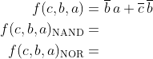
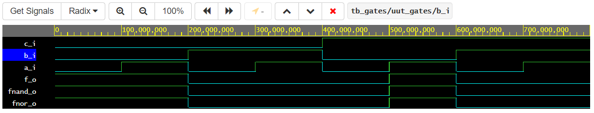
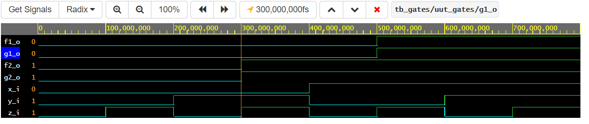

# Lab 1: Introduction to git and VHDL

## Links
[*My github repository*](https://github.com/Masauso-L/Digital-electronics-1/blob/main/Labs/01-gates/README.md)

[*My EDAplayground*](https://www.edaplayground.com/playgrounds/user/155968)

## `Task 1: De Morgan's`
### Function and truth table

| **c** | **b** |**a** | **f(c,b,a)** |
| :-: | :-: | :-: | :-: |
| 0 | 0 | 0 | 1 |
| 0 | 0 | 1 | 1 |
| 0 | 1 | 0 | 0 |
| 0 | 1 | 1 | 0 |
| 1 | 0 | 0 | 0 |
| 1 | 0 | 1 | 1 |
| 1 | 1 | 0 | 0 |
| 1 | 1 | 1 | 0 |

### De Morgan's source code: Listings of `design.vhd`

```VHDL
------------------------------------------------------------------------
library IEEE;
use IEEE.std_logic_1164.all;
------------------------------------------------------------------------
-- Entity declaration for basic gates
------------------------------------------------------------------------
entity gates is
    port(
        a_i    : in  std_logic;       -- Data input
        b_i    : in  std_logic;       -- Data input
        c_i    : in  std_logic;       -- Data input
        f_o     : out std_logic;      -- output function
        fnand_o : out std_logic;      -- NAND output function
        fnor_o  : out std_logic       -- NOR output function
    );
end entity gates;

------------------------------------------------------------------------
-- Architecture body for basic gates
------------------------------------------------------------------------
architecture dataflow of gates is
begin
    f_o     <= (not(b_i) and a_i) or (not(c_i) and not(b_i));
    fnand_o <= not(not(not(b_i) and a_i) and not(not(c_i) and not(b_i)));
    fnor_o  <= not(b_i or not(a_i)) or not(c_i or b_i);

end architecture dataflow;
```
### Simulated time waveform


## `Task 2: Distributive law`

### Equations


### Listing of `design.vhd`
```VHDL
-----------------------------------------------------------------------
-- Libraries
-----------------------------------------------------------------------
library IEEE;
use IEEE.std_logic_1164.all;

------------------------------------------------------------------------
-- Entity declaration for basic gates
------------------------------------------------------------------------
entity gates is
    port(
        x_i    : in  std_logic;      -- Data input
        y_i    : in  std_logic;      -- Data input
        z_i    : in  std_logic;      -- Data input
        f1_o   : out std_logic;      -- original expressions on the left
        f2_o   : out std_logic;         
        g1_o   : out std_logic;      -- equivalent expressions on the right
        g2_o   : out std_logic
    );
end entity gates;

------------------------------------------------------------------------
-- Architecture body for basic gates on distributive rule
-- It should hold that f1_o = g1_o and f2_o=g2_o as proof for distr. law
------------------------------------------------------------------------
architecture dataflow of gates is
begin
    f1_o  <= (x_i and y_i) or (x_i and z_i);
    g1_o  <= x_i and (y_i or z_i);
    f2_o  <= (x_i or y_i) and (x_i or z_i);
    g2_o  <= x_i or (y_i and z_i);

end architecture dataflow;
```

### Simulated waveform
