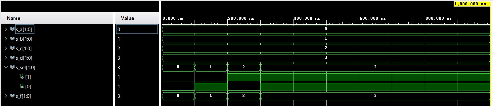
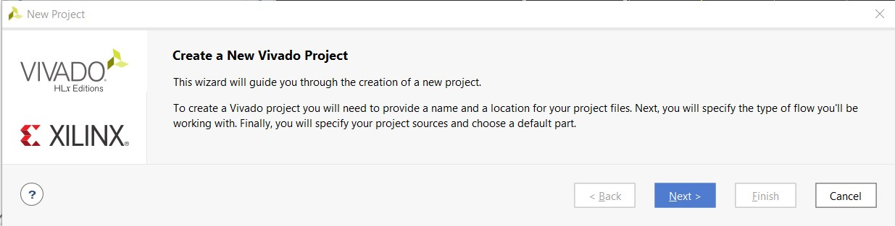
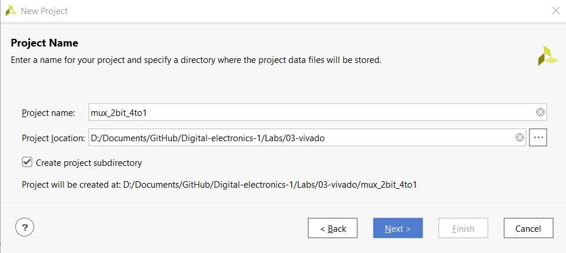
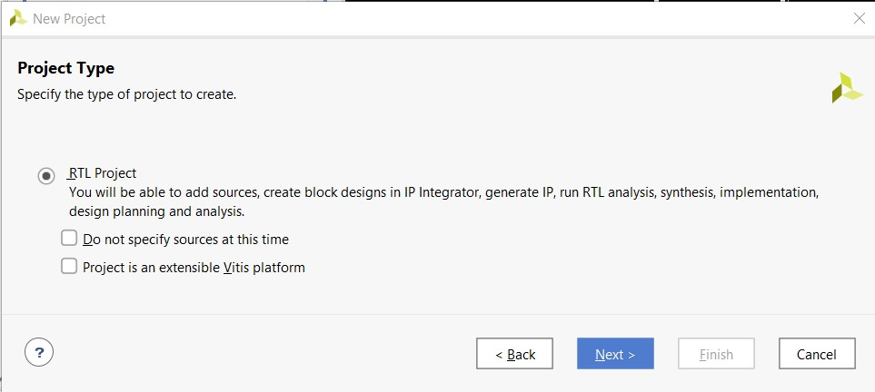
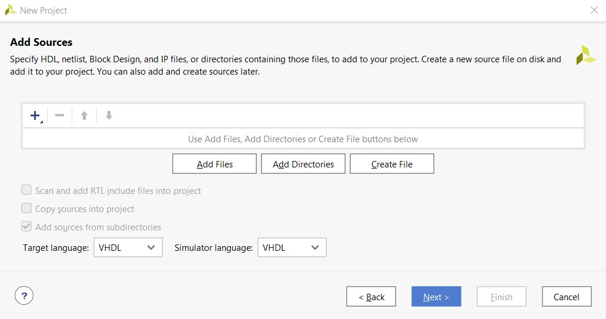
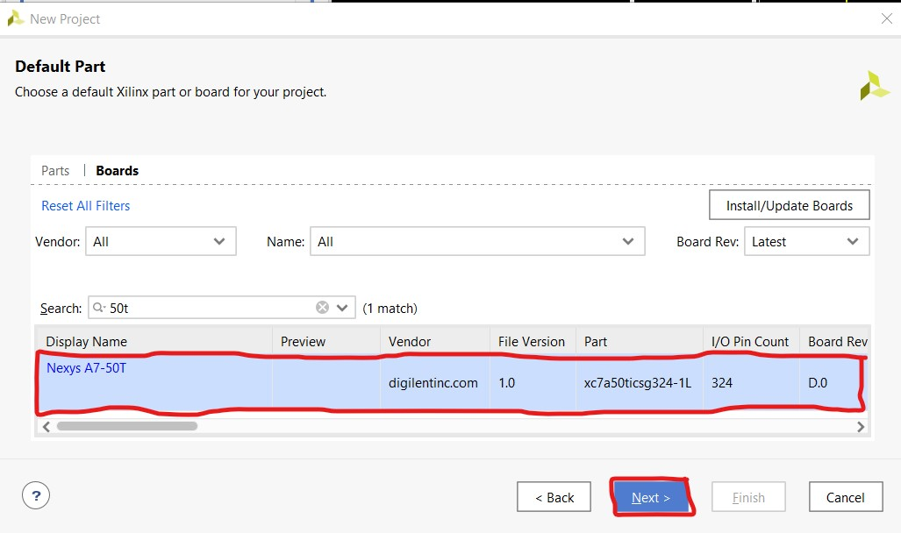
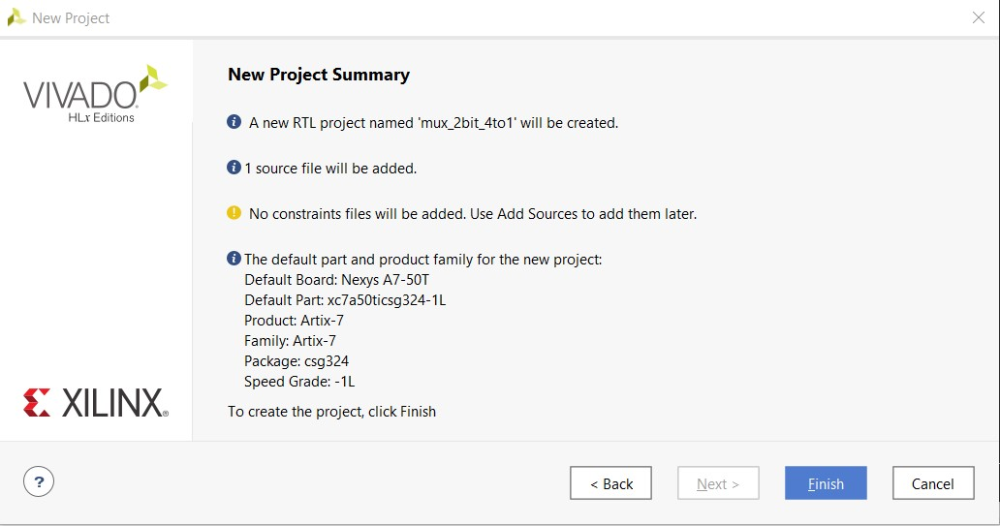
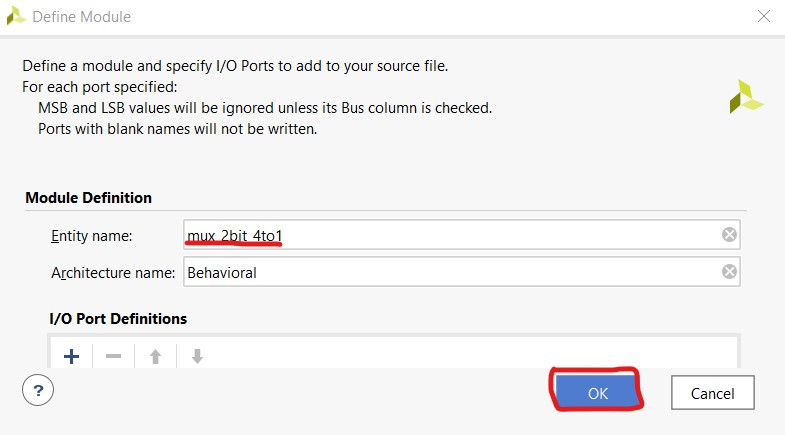

# Masauso Lungu 209533

# Lab 3: Introduction to Vivado

## Links:
[*My github repository*](https://github.com/Masauso-L/Digital-electronics-1/tree/main/Labs/03-vivado)

## Learning objectives
The purpose of this laboratory exercise is to learn to use Vivado to create a simple HDL design targeting Nexys A7 Artix-7 FPGA Trainer Board.

## Preparation task
 Connections of LEDs and slide switches to FPGA pins on Nexys A7 board.( Note: switch 8 and 9 connect to high voltage of 1.8 and the rest connect to 3.3 V)
| **LEDs** | **FPGA pins for LEDs** | **SLIDE SWITCHES** | **FPGA pins for Slide Switches** |
| :-: | :-: | :-: | :-: | 
| LD0 | H17 | SW0 | J15 | 
| LD1 | K15 | SW1 | L16 | 
| LD2 | J13 | SW2 | M13 | 
| LD3 | N14 | SW3 | R16 | 
| LD4 | R18 | SW4 | R17 | 
| LD5 | V17 | SW5 | T18 | 
| LD6 | U17 | SW6 | U18 | 
| LD7 | U16 | SW7 | R13 | 
| LD8 | V16 | SW8 | T8 | 
| LD9 | T15 | SW9 | U8 | 
| LD10 | U14 | SW10 | R16 | 
| LD11 | T16 | SW11 | T13 | 
| LD12 | V15 | SW12 | H6 | 
| LD13 | V14 | SW13 | U12 | 
| LD14 | V12 | SW14 | U11 | 
| LD15 | V11 | SW15 | V10 |  

## Assignment

## Two-bit wide 4-to-1 multiplexer
### architecture *mux_2bit_4to1.vhd*
```VHDL
-----------------------------------------------------------------
-- Architecture body for 4-to-1 mux
-----------------------------------------------------------------
architecture Behavioral of mux_2bit_4to1 is
begin
    f_o <= a_i when (sel_i = "00") else
           b_i when (sel_i = "01") else
           c_i when (sel_i = "10") else
           d_i;
           
end Behavioral;
```

### stimulus process of *tb_mux_2bit_4to1.vhd*
```VHDL
p_stimulus : process
    begin
        -- Report a note at the begining of stimulus process
        report "Stimulus process started" severity note;

        -- First test values
        s_d <= "11"; s_c <= "10"; s_b <= "01"; s_a <= "00";
        s_sel <= "00"; wait for 100 ns;
        -- Expected output
        assert (s_f = s_a)
        -- If false, then report an error
        report "Test failed for input combination: 00" severity error;
        
        -- 2nd test values
        s_sel <= "01"; wait for 100 ns;
        -- Expected output
        assert (s_f = s_b)
        -- If false, then report an error
        report "Test failed for input combination: 01" severity error;
        
        -- 3rd test values
        s_sel <= "10"; wait for 100 ns;
        -- Expected output
        assert (s_f = s_c)
        -- If false, then report an error
        report "Test failed for input combination: 10" severity error;
        
        -- 4th test values
        s_sel <= "11"; wait for 100 ns;
        -- Expected output
        assert (s_f = s_d)
        -- If false, then report an error
        report "Test failed for input combination: 11" severity error;
        
        -- Report a note at the end of stimulus process
        report "Stimulus process finished" severity note;
        wait;
    end process p_stimulus;

end architecture testbench;
```
### Simulations



## Vivado tutorial
### Step 1: Launching vivado
Launch vivado, select *create project*, then click *Next* on the following wizard.



### Step 2: Project name
Add *project name* and specify the *project location*, then click *Next*


### Step 2: Project type
Select *project type (RTL)*, then click *Next*



### Step 4: Adding source file
Specify the language for the target and simulator (VHDL), then click create file and add *name* (idealy same name as the module to be created) and click ok, then click *Next*.



### Step 5: Adding board/xilinx part
Choose a board (nexys-a7-50t), click *Next*, then *Finish*



### Step 6: Define module
Add module name and click ok (mux_2bit_4to1)


### Step 7: Adding source code.
On project manager, under sources on design sources double click the module name, then add the design code to the script file and save it
Use *project manager>sources>design sources> mux_2bit_4to1*

### Step 8: Adding simulation file
Use: *file>add sources> add/create simulation source* , then click create file and name it *tb_mux_2bit_4to1*

### Step 9: Adding source code for testbench
Use : *project manager>sources>simulation sources>sim_1>tb_mux_2bit_4to1* , doucle clik tb_mux_2bit_4to1 and add testbench code to the script file and save it

### Step 10: Simulation
On flow navigator, Use: *Simulation>run simulation>run behavioral simulation*, if there are no errors, a simulation will compile and a new windows with time waveform will open.

### Step 11: Adding constraints for implentation on hardware.
Use *file> add sources> add/create constraints*, then click create file, name it (ideally name of the board *nexys-a7-50t*) and click finish.

Use *project manager>sources>constaints>nexys-07-50t*, open the constaints file and add port definitions for inputs and outputs (eg LEDs and Switches).

### Step 12: Implemantation on hardware
On flow navigator, Use *Program and debug>generate bitstream* to generate bistream file. After verification, Use *program and debug> hardware manager>open target* and implement the generated bitstream on the target hardware


