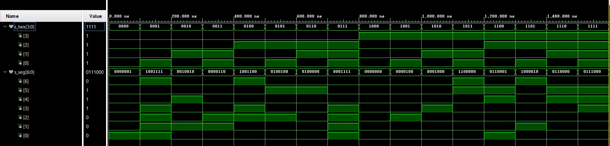
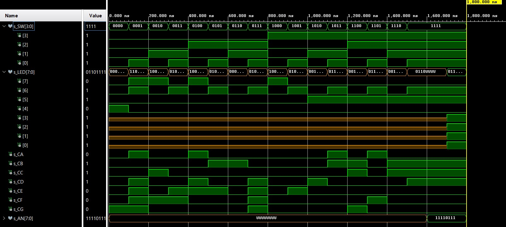

# Lab 4: Seven-segment display decoder

## Links:
[*My github repository*](https://github.com/Masauso-L/Digital-electronics-1/tree/main/Labs/04-segment)

### Learning objectives

The purpose of this laboratory exercise is to design a 7-segment display decoder and to become familiar with the VHDL structural description that allows you to build a larger system from simpler or predesigned components.

## 1 Preparation tasks (done before the lab at home)

The Nexys A7 board provides two four-digit common anode seven-segment LED displays (configured to behave like a single eight-digit display). See schematic or reference manual of the Nexys A7 board and find out the connection of 7-segment displays, ie to which FPGA pins are connected and how.

&nbsp;
### Connections of 7-segment display

&nbsp;
&nbsp;
| **Anodes** | **FPGA pins for Anodes** | **Cathodes** | **FPGA pins for CATHODES** |
| :-: | :-: | :-: | :-: | 
| AN0 | J17 | CA | T10 | 
| AN1 | J18 | CB | R10 | 
| AN2 | T9  | CC | K16 | 
| AN3 | J14 | CD | K13 | 
| AN4 | P14 | CE | P15 | 
| AN5 | T14 | CF | T11 | 
| AN6 | K2  | CG | L18 | 
| AN7 | U13 | CP | H15 | 

&nbsp;
&nbsp;

### Decoder conversion table for common anode 7-segment display.

| **Hex** | **Inputs** | **A** | **B** | **C** | **D** | **E** | **F** | **G** |
| :-: | :-: | :-: | :-: | :-: | :-: | :-: | :-: | :-: |
| 0 | 0000 | 0 | 0 | 0 | 0 | 0 | 0 | 1 |
| 1 | 0001 | 1 | 0 | 0 | 1 | 1 | 1 | 1 |
| 2 | 0010 | 0 | 0 | 1 | 0 | 0 | 1 | 0 |
| 3 | 0011 | 0 | 0 | 0 | 0 | 1 | 1 | 0 |
| 4 | 0100 | 1 | 0 | 0 | 1 | 1 | 0 | 0 |
| 5 | 0101 | 0 | 1 | 0 | 0 | 1 | 0 | 0 |
| 6 | 0110 | 0 | 1 | 0 | 0 | 0 | 0 | 0 |
| 7 | 0111 | 0 | 0 | 0 | 1 | 1 | 1 | 1 |
| 8 | 1000 | 0 | 0 | 0 | 0 | 0 | 0 | 0 |
| 9 | 1001 | 0 | 0 | 0 | 0 | 1 | 0 | 0 |
| A | 1010 | 0 | 0 | 0 | 1 | 0 | 0 | 0 |
| b | 1011 | 1 | 1 | 0 | 0 | 0 | 0 | 0 |
| C | 1100 | 0 | 1 | 1 | 0 | 0 | 0 | 1 |
| d | 1101 | 1 | 0 | 0 | 0 | 0 | 1 | 0 |
| E | 1110 | 0 | 1 | 1 | 0 | 0 | 0 | 0 |
| F | 1111 | 0 | 1 | 1 | 1 | 0 | 0 | 0 |

&nbsp;
&nbsp;

## 2 Seven-segment display decoder

### Listings of *hex_7seg.vhd* architecture
```VHDL
architecture Behavioral of hex_7seg is

begin

    --------------------------------------------------------------------
    -- p_7seg_decoder:
    -- A combinational process for 7-segment display decoder. 
    -- Any time "hex_i" is changed, the process is "executed".
    -- Output pin seg_o(6) corresponds to segment A, seg_o(5) to B, etc.
    --------------------------------------------------------------------
    p_7seg_decoder : process(hex_i)
    begin
        case hex_i is
            when "0000" =>
                seg_o <= "0000001";     -- 0
            when "0001" =>
                seg_o <= "1001111";     -- 1
            when "0010" =>
                seg_o <= "0010010";     -- 2
            when "0011" =>
                seg_o <= "0000110";     -- 3
            when "0100" =>
                seg_o <= "1001100";     -- 4
            when "0101" =>
                seg_o <= "0100100";     -- 5
             when "0110" =>
                seg_o <= "0100000";     -- 6
            when "0111" =>
                seg_o <= "0001111";     -- 7
            when "1000" =>
                seg_o <= "0000000";     -- 8
            when "1001" =>
                seg_o <= "0000100";     -- 9
            when "1010" =>
                seg_o <= "0001000";     -- A
            when "1011" =>
                seg_o <= "1100000";     -- b           
            when "1100" =>
                seg_o <= "0110001";     -- C
            when "1101" =>
                seg_o <= "1000010";     -- d
            when "1110" =>
                seg_o <= "0110000";     -- E
            when others =>
                seg_o <= "0111000";     -- F
        end case;
    end process p_7seg_decoder;

end architecture behavioral;
```
&nbsp;

### Listings of *tb_hex_7seg.vhd* stimulus process
```VHDL
-- Data generation process
    --------------------------------------------------------------------
    p_stimulus : process
    begin
        -- Report a note at the begining of stimulus process
        report "Stimulus process started" severity note;
        
        s_hex <= "0000"; wait for 100 ns;
        -- Expected output 0
        assert (s_seg = b"0000001")
        -- If false, then report an error
        report "Test failed for input combination: 0000" severity error;
        
        s_hex <= "0001"; wait for 100 ns;
        -- Expected output 1
        assert (s_seg = b"1001111")
        -- If false, then report an error
        report "Test failed for input combination: 0001" severity error;
        
        s_hex <= "0010"; wait for 100 ns;
        -- Expected output 2
        assert (s_seg = b"0010010")
        -- If false, then report an error
        report "Test failed for input combination: 0010" severity error;
        
        s_hex <= "0011"; wait for 100 ns;
        -- Expected output 3
        assert (s_seg = b"0000110")
        -- If false, then report an error
        report "Test failed for input combination: 0011" severity error;
        
        s_hex <= "0100"; wait for 100 ns;
        -- Expected output
        assert (s_seg = b"1001100")
        -- If false, then report an error
        report "Test failed for input combination: 0100" severity error;
        
        s_hex <= "0101"; wait for 100 ns;
        -- Expected output 5
        assert (s_seg = b"0100100")
        -- If false, then report an error
        report "Test failed for input combination: 0101" severity error;
        
        s_hex <= "0110"; wait for 100 ns;
        -- Expected output 6
        assert (s_seg = b"0100000")
        -- If false, then report an error
        report "Test failed for input combination: 0110" severity error;
        
        s_hex <= "0111"; wait for 100 ns;
        -- Expected output 7
        assert (s_seg = b"0001111")
        -- If false, then report an error
        report "Test failed for input combination: 0111" severity error;
        
        s_hex <= "1000"; wait for 100 ns;
        -- Expected output 8
        assert (s_seg = b"0000000")
        -- If false, then report an error
        report "Test failed for input combination: 1000" severity error;
        
        s_hex <= "1001"; wait for 100 ns;
        -- Expected output 9
        assert (s_seg = b"0000100")
        -- If false, then report an error
        report "Test failed for input combination: 1001" severity error;
        
        s_hex <= "1010"; wait for 100 ns;
        -- Expected output A
        assert (s_seg = b"0001000")
        -- If false, then report an error
        report "Test failed for input combination: 1010" severity error;
        
        s_hex <= "1011"; wait for 100 ns;
        -- Expected output b
        assert (s_seg = b"1100000")
        -- If false, then report an error
        report "Test failed for input combination: 1011" severity error;
        
        s_hex <= "1100"; wait for 100 ns;
        -- Expected output C
        assert (s_seg = b"0110001")
        -- If false, then report an error
        report "Test failed for input combination: 1100" severity error;
        
        s_hex <= "1101"; wait for 100 ns;
        -- Expected output d
        assert (s_seg = b"1000010")
        -- If false, then report an error
        report "Test failed for input combination: 1101" severity error;
        
        s_hex <= "1110"; wait for 100 ns;
        -- Expected output E
        assert (s_seg = b"0110000")
        -- If false, then report an error
        report "Test failed for input combination: 1110" severity error;
        
        s_hex <= "1111"; wait for 100 ns;
        -- Expected output F
        assert (s_seg = b"0111000")
        -- If false, then report an error
        report "Test failed for input combination: 1111" severity error;
        
        -- Report a note at the end of stimulus process
        report "Stimulus process finished" severity note;
        wait;
    end process p_stimulus;
```
&nbsp;
&nbsp;
### Listing of *top.vhd* with 7-segment module instantiation
```VHDL
    --------------------------------------------------------------------
    -- Instance (copy) of hex_7seg entity
    hex2seg : entity work.hex_7seg
        port map(
            hex_i    => SW,
            seg_o(6) => CA,
            seg_o(5) => CB,
            seg_o(4) => CC,
            seg_o(3) => CD,
            seg_o(2) => CE,
            seg_o(1) => CF,
            seg_o(0) => CG
        );
```

### Simulation of 7-segment

&nbsp;
&nbsp;

## LED(7:4) indicators
### Truth table for LEDs 
| **Hex** | **Inputs** | **LED4** | **LED5** | **LED6** | **LED7** |
| :-: | :-: | :-: | :-: | :-: | :-: |
| 0 | 0000 | 1 | 0 | 0 | 0 |
| 1 | 0001 | 0 | 0 | 1 | 0 |
| 2 | 0010 | 0 | 0 | 0 | 1 |
| 3 | 0011 | 0 | 0 | 1 | 0 |
| 4 | 0100 | 0 | 0 | 0 | 1 |
| 5 | 0101 | 0 | 0 | 1 | 0 |
| 6 | 0110 | 0 | 0 | 0 | 0 |
| 7 | 0111 | 0 | 0 | 1 | 0 |
| 8 | 1000 | 0 | 0 | 0 | 1 |
| 9 | 1001 | 0 | 0 | 1 | 0 |
| A | 1010 | 0 | 1 | 0 | 0 |
| b | 1011 | 0 | 1 | 1 | 0 |
| C | 1100 | 0 | 1 | 0 | 0 |
| d | 1101 | 0 | 1 | 1 | 0 |
| E | 1110 | 0 | 1 | 0 | 0 |
| F | 1111 | 0 | 1 | 1 | 0 |

&nbsp;
&nbsp;

### Listings of *top.vhd* architecture with LEDs(7:4)
```VHDL
architecture Behavioral of top is
begin

    --------------------------------------------------------------------
    -- Instance (copy) of hex_7seg entity
    hex2seg : entity work.hex_7seg
        port map(
            hex_i    => SW,
            seg_o(6) => CA,
            seg_o(5) => CB,
            seg_o(4) => CC,
            seg_o(3) => CD,
            seg_o(2) => CE,
            seg_o(1) => CF,
            seg_o(0) => CG
        );

    -- Connect one common anode to 3.3V
    AN <= b"1111_0111";

    -- Display input value
    LED(3 downto 0) <= SW;

    -- Turn LED(4) on if input value is equal to 0, ie "0000"
    LED(4) <= '1' when (SW = b"0000") else '0';
    
    -- Turn LED(5) on if input value is greater than 9
    LED(5) <= '1' when (SW > b"1001") else '0';
    
    -- Turn LED(6) on if input value is odd, ie 1, 3, 5, ...
    LED(6) <= '1' when (SW = b"0001") or (SW = b"0011") or (SW = b"0101")
                  or(SW = b"0111") or (SW = b"1001") or (SW = b"1011") 
                  or(SW = b"1101") or (SW = b"1111") else '0';
          
    -- Turn LED(7) on if input value is a power of two, ie 1, 2, 4, or 8
    LED(7) <= '1' when (SW = b"0001") or (SW = b"0010") or (SW = b"0100")
                  or(SW = b"1000") else '0';
                  

end architecture Behavioral;
```
&nbsp;
&nbsp;
### Simulated waveform for *tb_top.vhd*

