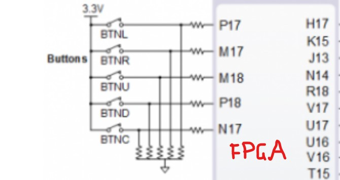

# Lab 5: Binary counter

## Links:
[*My github repository*](https://github.com/Masauso-L/Digital-electronics-1/tree/main/Labs/05-counter)
## Preparation tasks (done before the lab at home)

The Nexys A7 board provides six push buttons. See schematic or reference manual of the Nexys A7 board and find out the connection of these push buttons, ie to which FPGA pins are connected and how. What output the push buttons normally generate when they are at rest, and what output when the push buttons are pressed?

&nbsp;

&nbsp;

&nbsp;

&nbsp;

&nbsp;

&nbsp;

Calculate how many periods of clock signal with frequency of 100&nbsp;MHz contain time intervals 2&nbsp;ms, 4&nbsp;ms, 10&nbsp;ms, 250&nbsp;ms, 500&nbsp;ms, and 1&nbsp;s. Write values in decimal, binary, and hexadecimal forms.

   &nbsp; 
   `T_clk = 1/f_clk`
   &nbsp;

   | **Time interval** | **Number of clk periods** | **Number of clk periods in hex** | **Number of clk periods in binary** |
   | :-: | :-: | :-: | :-: |
   | 2&nbsp;ms | 200 000 | `x"3_0d40"` | `b"0011_0000_1101_0100_0000"` |
   | 4&nbsp;ms | 400 000 | `x"61a80"`  | `b"0110_0001_1010_1000_0000"` |
   | 10&nbsp;ms  | 1000 000 | `x"f4240"` | `b"1111_0100_0010_0100_0000"` |
   | 250&nbsp;ms | 25 000 000 | `x"17d7840"` | `b"0001_0111_1101_0111_1000_0100_0000"` |
   | 500&nbsp;ms | 50 000 000 | `x"2faf080"` | `b"0010_1111_1010_1111_0000_1000_0000"` |
   | 1&nbsp;sec  | 100 000 000 | `x"5F5_E100"` | `b"0101_1111_0101_1110_0001_0000_0000"` |
