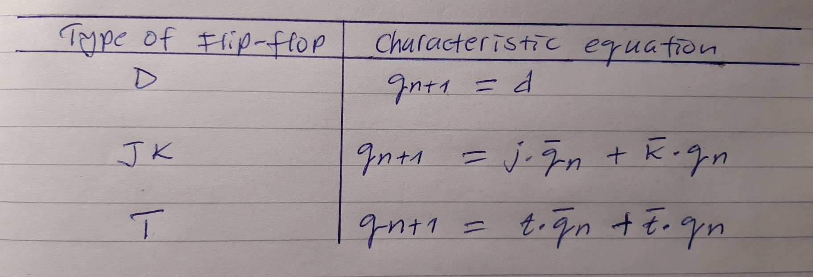
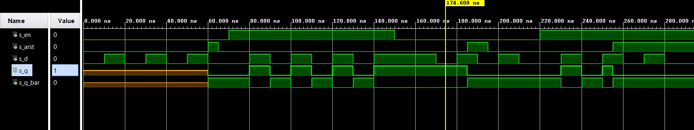
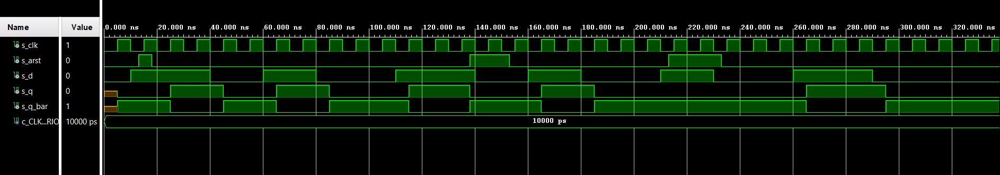
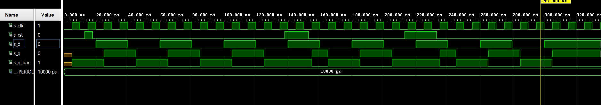
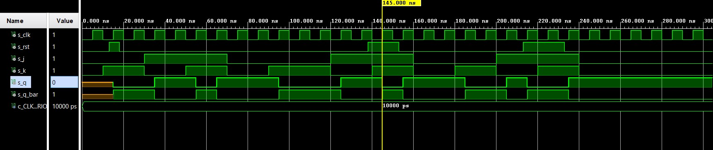
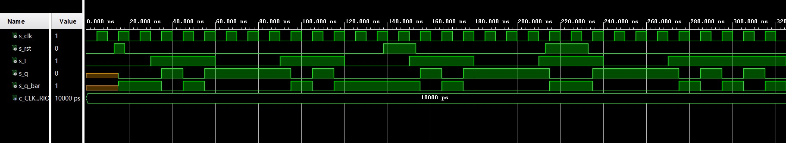
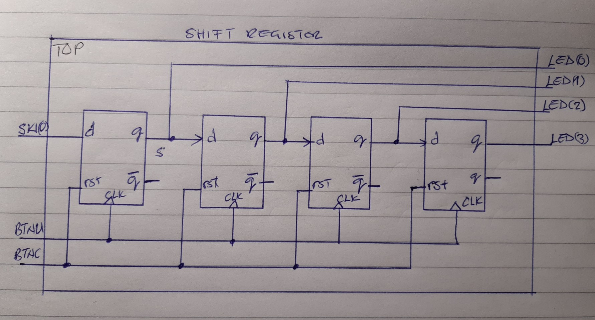

# Masauso Lungu 209533


## Links:
[*My github repository*](https://github.com/Masauso-L/Digital-electronics-1/tree/main/Labs/07-ffs)

# Lab 7: Latches and Flip-flops

## Preparation tasks (done before the lab at home)

Write characteristic equations and complete truth tables for D, JK, T flip-flops.



   | **D** | **Qn** | **Q(n+1)** | **Comments** |
   | :-: | :-: | :-: | :-- |
   | 0 | 0 | 0 | No change |
   | 0 | 1 | 0 | Resets output Qn |
   | 1 | 0 | 1 | Set state |
   | 1 | 1 | 1 | No change |

   | **J** | **K** | **Qn** | **Q(n+1)** | **Comments** |
   | :-: | :-: | :-: | :-: | :-- |
   | 0 | 0 | 0 | 0 | No change |
   | 0 | 0 | 1 | 1 | No change |
   | 0 | 1 | 0 | 0 | Reset Q>>0 |
   | 0 | 1 | 1 | 0 | Reset Q>>0 |
   | 1 | 0 | 0 | 1 | Set Q>>1 |
   | 1 | 0 | 1 | 1 | Set Q>>1 |
   | 1 | 1 | 0 | 1 | Toggle |
   | 1 | 1 | 1 | 0 | Toggle |

   | **T** | **Qn** | **Q(n+1)** | **Comments** |
   | :-: | :-: | :-: | :-- |
   | 0 | 0 | 0 | Hold |
   | 0 | 1 | 1 | Hold |
   | 1 | 0 | 1 | Toggle |
   | 1 | 1 | 0 | Toggle |

## 2. D Latch
### 2.1 HHDL process p_d_latch
```VHDL
   p_d_latch :process(en, d, arst)
    begin
        if (arst = '1') then 
            q     <= '0';
            q_bar <= '1';
        elsif (en = '1') then
            q     <= d;
            q_bar <= not d;
        end if;
        
    end process p_d_latch;   
```    

### 2.2 VHDL testbench *tb_d_latch.vdh*
```VHDL
   --------------------------------------------------------------------
    -- reset generation process
    --------------------------------------------------------------------
    p_reset_gen : process
    begin
        s_arst <= '0'; wait for 60 ns;  
        s_arst <= '1'; wait for 5 ns;  --activate reset
        s_arst <= '0'; wait for 120 ns; --deactivate reset
        s_arst <= '1'; wait for 10 ns;
        s_arst <= '0'; wait for 60 ns;
        s_arst <= '1';
        
        wait;
    end process p_reset_gen;
    
    --------------------------------------------------------------------
    -- stimulus process
    --------------------------------------------------------------------
    p_stimulus : process
    begin
        report "Stimulus process started" severity note;
        s_en <= '0';
        s_d  <= '0';
        wait for 10 ns;
        
        -- d sequence
        s_d <= '1'; wait for 10 ns;
        s_d <= '0'; wait for 10 ns;
        s_d <= '1'; wait for 10 ns;
        s_d <= '0'; wait for 10 ns;
        s_d <= '1'; wait for 10 ns;
        s_d <= '0'; wait for 10 ns;
        
        s_en <= '1'; wait for 3 ns;
        assert(s_q = '0' and s_q_bar = '1')
        report "Enable fault" severity error;
        wait for 7 ns;
        
        -- d sequence
        s_d <= '1'; wait for 10 ns;
        s_d <= '0'; wait for 10 ns;
        s_d <= '1'; wait for 10 ns;
        s_d <= '0'; wait for 10 ns;
        s_d <= '1'; wait for 10 ns;
        s_d <= '0'; wait for 10 ns;
        s_d <= '1'; wait for 10 ns;
        
        s_en <= '0'; wait for 5 ns;
        assert(s_q = '1' and s_q_bar = '0')
        report "Hold failed " severity error;
        wait for 5 ns;
 
        -- d sequence
        s_d <= '1'; wait for 10 ns;
        s_d <= '0'; wait for 10 ns;
        s_d <= '1'; wait for 10 ns;
        s_d <= '0'; wait for 10 ns;
        s_d <= '1'; wait for 10 ns;
        s_d <= '0'; wait for 10 ns;
        
        s_en <= '1'; wait for 10 ns;
        
        -- d sequence
        s_d <= '1'; wait for 10 ns;
        s_d <= '0'; wait for 10 ns;
        s_d <= '1'; wait for 10 ns;
        s_d <= '0'; wait for 10 ns;
        s_d <= '1'; wait for 10 ns;
        s_d <= '0'; wait for 10 ns;
        
        report "Stimulus process finished" severity note;
        wait;
    end process p_stimulus;
```

### 2.3 *tb_d_latch.vdh* simulated waveforms


## 3 Flip-flops
### 3.1 *d_ff_arst*
* VHDL process p_d_ff_arst
```VHDL
p_d_ff_arst :process(clk, arst)
    begin
        if (arst = '1') then 
            q     <= '0';
            q_bar <= '1';
        elsif rising_edge(clk) then
            q     <= d;
            q_bar <= not d;
        end if;
        
    end process p_d_ff_arst; 
 ```
 * VHDL testbench *tb_d_ff_arst.vhd* process
 ```VHDL
 --------------------------------------------------------------------
    -- clock generation process
    --------------------------------------------------------------------    
    p_clk_gen : process
    begin
        while now < 400 ns loop
            s_clk <= '0';
            wait for c_CLK_100MHZ_PERIOD / 2;
            s_clk <= '1';
            wait for c_CLK_100MHZ_PERIOD / 2;
        end loop;
        wait;
    end process p_clk_gen;
   
    --------------------------------------------------------------------
    -- reset generation process
    --------------------------------------------------------------------
    p_reset_gen : process
    begin
        s_arst <= '0'; wait for 13 ns;  
        s_arst <= '1'; wait for 5 ns;   --activate reset
        s_arst <= '0'; wait for 120 ns; --deactivate reset
        s_arst <= '1'; wait for 15 ns;
        s_arst <= '0'; wait for 60 ns;
        s_arst <= '1'; wait for 20 ns;
        s_arst <= '0';
        
        wait;
    end process p_reset_gen;
    
    --------------------------------------------------------------------
    -- stimulus process
    --------------------------------------------------------------------
    p_stimulus : process
    begin
        report "Stimulus process started" severity note;
        
        s_d <= '0'; wait for 10 ns;
        
        -- d sequence
        s_d <= '1'; wait for 30 ns;
        s_d <= '0'; wait for 20 ns;
        s_d <= '1'; wait for 20 ns;
        s_d <= '0'; wait for 30 ns;
        s_d <= '1'; wait for 30 ns;
        s_d <= '0'; wait for 20 ns;
        s_d <= '1'; wait for 20 ns;
        s_d <= '0'; wait for 30 ns;
        s_d <= '1'; wait for 20 ns;
        s_d <= '0'; wait for 30 ns;
        s_d <= '1'; wait for 30 ns;
        s_d <= '0'; wait for 20 ns;
        
        
        report "Stimulus process finished" severity note;
        wait;
    end process p_stimulus;
```
* d_ff_arst simulation


### 3.2 *d_ff_rst*
* process *d_ff_rst.vhd*
```VHDL
   
    p_d_ff_rst : process(clk)
    begin
        if rising_edge(clk) then
            if (rst = '1') then
                q     <= '0';
                q_bar <= '1';
            else
                q     <= d;
                q_bar <= not d;
            end if;
        end if;
    end process p_d_ff_rst;
```
* stimulus process of *tb_d_ff_rst.vhd*
```VHDL
   --------------------------------------------------------------------
   -- clock generation process
   --------------------------------------------------------------------
    p_clk_gen : process
    begin
        while now < 400 ns loop
            s_clk <= '0';
            wait for c_CLK_100MHZ_PERIOD / 2;
            s_clk <= '1';
            wait for c_CLK_100MHZ_PERIOD / 2;
        end loop;
        wait;
    end process p_clk_gen;
   --------------------------------------------------------------------
    -- reset generation process
   --------------------------------------------------------------------
    p_reset_gen : process
    begin
        s_rst <= '0'; wait for 13 ns;  
        s_rst <= '1'; wait for 5 ns;   --activate reset
        s_rst <= '0'; wait for 120 ns; --deactivate reset
        s_rst <= '1'; wait for 15 ns;
        s_rst <= '0'; wait for 60 ns;
        s_rst <= '1'; wait for 20 ns;
        s_rst <= '0';
        
        wait;
    end process p_reset_gen;

    p_stimulus : process
    begin
        report "Stimulus process started" severity note;
        
        s_d <= '0'; wait for 20 ns;
        s_d <= '1'; wait for 20 ns;
        s_d <= '0'; wait for 20 ns;
        s_d <= '1'; wait for 20 ns;
        s_d <= '0'; wait for 20 ns;
        s_d <= '1'; wait for 20 ns;
        s_d <= '0'; wait for 20 ns;
        s_d <= '1'; wait for 20 ns;
        s_d <= '0'; wait for 20 ns;
        s_d <= '1'; wait for 20 ns;
        s_d <= '0'; wait for 20 ns;
        s_d <= '1'; wait for 20 ns;
        s_d <= '0'; wait for 20 ns;
        s_d <= '1'; wait for 20 ns;
        s_d <= '0'; wait for 20 ns;
        s_d <= '1'; wait for 20 ns;

        report "Stimulus process finished" severity note;
        wait;
    end process p_stimulus;
```
* 

### 3.3 JK Flip-flop
 * *jk_ff_rst.vhd* process
```VHDL
    p_jk_ff_rst : process(clk)
    begin
        if rising_edge(clk) then
            if (rst = '1') then
                s_q     <= '0';
            else
                if (j = '0' and k = '0') then
                    s_q     <= s_q;
                elsif (j = '0' and k = '1') then
                    s_q     <= '0';
                elsif (j = '1' and k = '0') then
                    s_q     <= '1';
                elsif (j = '1' and k = '1') then
                    s_q     <= not s_q;
                end if;
            end if;
        end if;
    end process p_jk_ff_rst;
    q     <= s_q;
    q_bar <= not s_q;

```

* *tb_jk_ff_rst.vhd* stimulus process
```VHDL
--------------------------------------------------------------------
    -- clock generation process
    --------------------------------------------------------------------    
    p_clk_gen : process
    begin
        while now < 400 ns loop
            s_clk <= '0';
            wait for c_CLK_100MHZ_PERIOD / 2;
            s_clk <= '1';
            wait for c_CLK_100MHZ_PERIOD / 2;
        end loop;
        wait;
    end process p_clk_gen;
   
    --------------------------------------------------------------------
    -- reset generation process
    --------------------------------------------------------------------
    p_reset_gen : process
    begin
        s_rst <= '0'; wait for 13 ns;  
        s_rst <= '1'; wait for 5 ns;   --activate reset
        s_rst <= '0'; wait for 120 ns; --deactivate reset
        s_rst <= '1'; wait for 15 ns;
        s_rst <= '0'; wait for 60 ns;
        s_rst <= '1'; wait for 20 ns;
        s_rst <= '0';
        
        wait;
    end process p_reset_gen;
    
    --------------------------------------------------------------------
    -- stimulus process
    --------------------------------------------------------------------
    p_stimulus : process
    begin
        report "Stimulus process started" severity note;
        
        -- jk sequence
        s_j <= '0'; s_k <= '0'; wait for 10 ns;
        s_j <= '0'; s_k <= '1'; wait for 20 ns;
        s_j <= '1'; s_k <= '0'; wait for 20 ns;
        s_j <= '1'; s_k <= '1'; wait for 20 ns;
        s_j <= '0'; s_k <= '0'; wait for 20 ns;
        s_j <= '0'; s_k <= '1'; wait for 30 ns;
        s_j <= '1'; s_k <= '0'; wait for 20 ns;
        s_j <= '1'; s_k <= '1'; wait for 20 ns;
        s_j <= '0'; s_k <= '0'; wait for 20 ns;
        s_j <= '0'; s_k <= '1'; wait for 20 ns;
        s_j <= '1'; s_k <= '0'; wait for 20 ns;
        s_j <= '1'; s_k <= '1'; wait for 20 ns;
        s_j <= '0'; s_k <= '0'; wait for 20 ns;
        
        report "Stimulus process finished" severity note;
        wait;
    end process p_stimulus;
```
* 

### 3.4 *T Flip-flop*
* *t_ff_rst.vhd* process
```VHDL
begin
    p_t_ff_rst : process(clk)
    begin
        if rising_edge(clk) then
            if (rst = '1') then
                s_q     <= '0';
            elsif (t = '1') then
                s_q     <= not s_q;
            end if;
        end if;
    end process p_t_ff_rst;
    q     <= s_q;
    q_bar <= not s_q;
```
* *tb_t_ff_rst.vhd* stimulus process
```VHDL
--------------------------------------------------------------------
    -- clock generation process
    --------------------------------------------------------------------    
    p_clk_gen : process
    begin
        while now < 400 ns loop
            s_clk <= '0';
            wait for c_CLK_100MHZ_PERIOD / 2;
            s_clk <= '1';
            wait for c_CLK_100MHZ_PERIOD / 2;
        end loop;
        wait;
    end process p_clk_gen;
   
    --------------------------------------------------------------------
    -- reset generation process
    --------------------------------------------------------------------
    p_reset_gen : process
    begin
        s_rst <= '0'; wait for 13 ns;  
        s_rst <= '1'; wait for 5 ns;   --activate reset
        s_rst <= '0'; wait for 120 ns; --deactivate reset
        s_rst <= '1'; wait for 15 ns;
        s_rst <= '0'; wait for 60 ns;
        s_rst <= '1'; wait for 20 ns;
        s_rst <= '0';
        
        wait;
    end process p_reset_gen;
    
    --------------------------------------------------------------------
    -- stimulus process
    --------------------------------------------------------------------
    p_stimulus : process
    begin
        report "Stimulus process started" severity note;
        
        -- t sequence
        s_t <= '0'; wait for 30 ns;
        s_t <= '1'; wait for 30 ns;
        s_t <= '0'; wait for 30 ns;
        s_t <= '1'; wait for 30 ns;
        s_t <= '0'; wait for 30 ns;
        s_t <= '1'; wait for 30 ns;
        s_t <= '0'; wait for 30 ns;
        s_t <= '1'; wait for 30 ns;
        s_t <= '0'; wait for 30 ns;
        s_t <= '1'; wait for 30 ns;
     
        report "Stimulus process finished" severity note;
        wait;
    end process p_stimulus;
```

* 

## 4 Registry
* 


