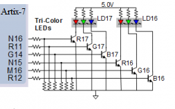
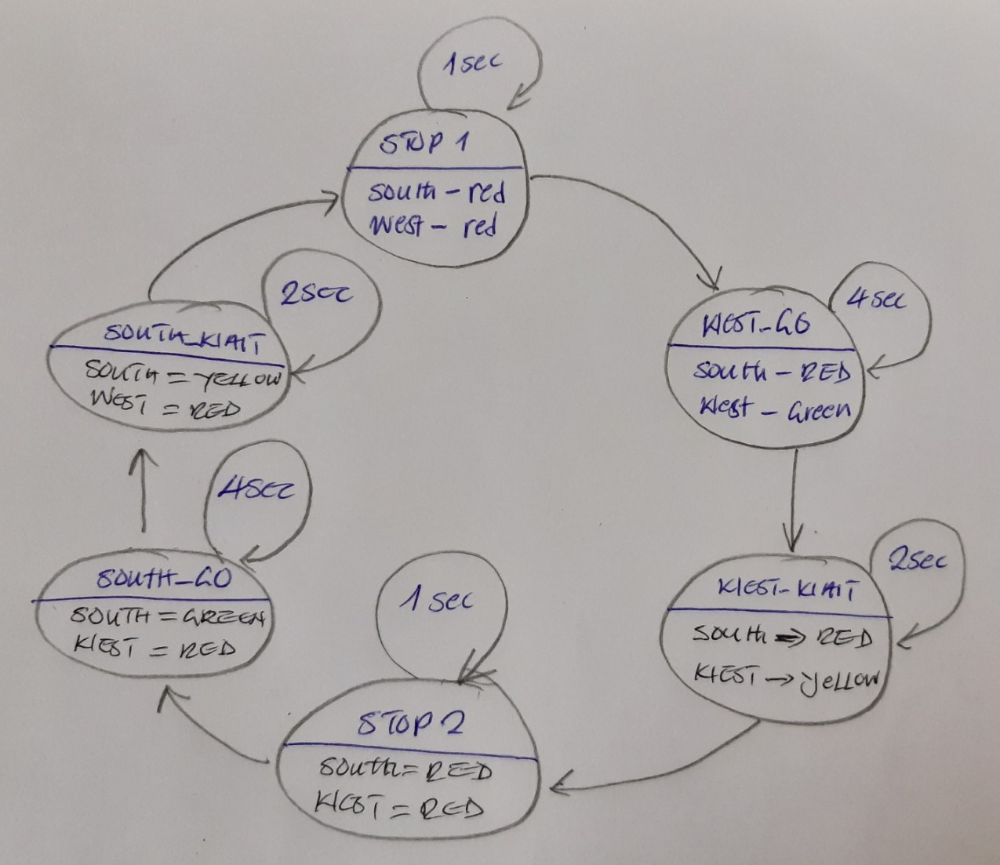
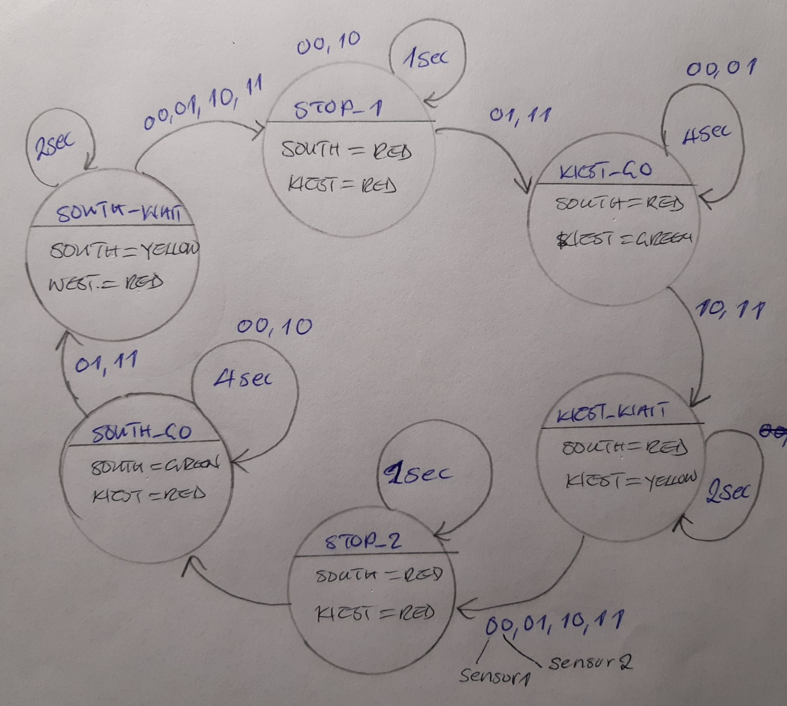
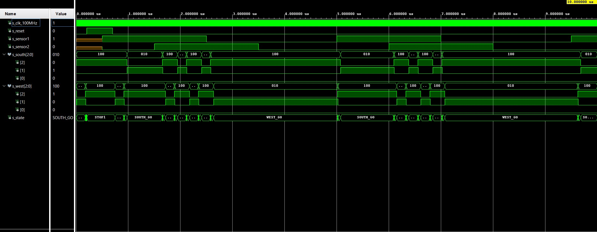

# Masauso Lungu 209533


## Links:
[*My github repository*](https://github.com/Masauso-L/Digital-electronics-1/tree/main/Labs/08-traffic_lights)

# Lab 8: Traffic light controller

## 1 Preparation tasks (done before the lab at home)
Fill in the table with the state names and output values accoding to the given inputs. Let the reset has just been applied.

### 1.1 states
| **Input P** | `0` | `0` | `1` | `1` | `0` | `1` | `0` | `1` | `1` | `1` | `1` | `0` | `0` | `1` | `1` | `1` |
| :-- | :-: | :-: | :-: | :-: | :-: | :-: | :-: | :-: | :-: | :-: | :-: | :-: | :-: | :-: | :-: | :-: |
| **Clock** |  |  |  |  |  |  |  |  |  |  |  |  |  |  |  |  |
| **State** | A | A |  B| C | C | D | A | B | C | D | B | B | B | C | D | B |
| **Output R** | `0` | `0` | `0` | `0`  |`0`  |`1`| `0` | `0` | `0` | `1` | `0` | `0` | `0` |`0`  | `1` | `0` |

### 1.2 LEDs connections
See schematic or reference manual of the Nexys board and find out the connection of two RGB LEDs. How you can control them to get red, yellow, or green colors?

&nbsp;

&nbsp;

&nbsp;

&nbsp;


| **RGB LED** | **Artix-7 pin names** | **Red** | **Yellow** | **Green** |
| :-: | :-: | :-: | :-: | :-: |
| LD16 | N15, M16, R12 | `1,0,0` | `1,1,0` | `0,1,0` |
| LD17 | N16, R11, G14 | `1,1,0` | `1,1,0` | `0,1,0` |

&nbsp;
&nbsp;
## 2. Traffic light controller

### 2.1 State diagram


&nbsp;
&nbsp;

### 2.2 Listing of VHDL code of sequential process `p_traffic_fsm` 
```VHDL
--------------------------------------------------------------------
    -- p_traffic_fsm:
    -- The sequential process with synchronous reset and clock_enable 
    -- entirely controls the s_state signal by CASE statement.
    --------------------------------------------------------------------
    p_traffic_fsm : process(clk)
    begin
        if rising_edge(clk) then
            if (reset = '1') then       -- Synchronous reset
                s_state <= STOP1 ;      -- Set initial state
                s_cnt   <= c_ZERO;      -- Clear all bits

            elsif (s_en = '1') then
                -- Every 250 ms, CASE checks the value of the s_state 
                -- variable and changes to the next state according 
                -- to the delay value.
                case s_state is

                    -- If the current state is STOP1, then wait 1 sec
                    -- and move to the next GO_WAIT state.
                    when STOP1 =>
                        -- Count up to c_DELAY_1SEC
                        if (s_cnt < c_DELAY_1SEC) then
                            s_cnt <= s_cnt + 1;
                        else
                            -- Move to the next state
                            s_state <= WEST_GO;
                            -- Reset local counter value
                            s_cnt   <= c_ZERO;
                        end if;

                    when WEST_GO =>
                        if(s_cnt < c_DELAY_4SEC) then
                            s_cnt <= s_cnt +1;
                        else
                            s_state <= WEST_WAIT;
                            s_cnt   <= c_ZERO;
                        end if;
                    
                    when WEST_WAIT =>
                        if(s_cnt < c_DELAY_2SEC) then
                            s_cnt <= s_cnt +1;
                        else
                            s_state <= STOP2;
                            s_cnt   <= c_ZERO;
                        end if;
                        
                    when STOP2 =>
                        if(s_cnt < c_DELAY_1SEC) then
                            s_cnt <= s_cnt +1;
                        else
                            s_state <= SOUTH_GO;
                            s_cnt   <= c_ZERO;
                        end if;
                    
                    when SOUTH_GO =>
                        if(s_cnt < c_DELAY_4SEC) then
                            s_cnt <= s_cnt +1;
                        else
                            s_state <= SOUTH_WAIT;
                            s_cnt   <= c_ZERO;
                        end if; 
                    
                    when SOUTH_WAIT =>
                        if(s_cnt < c_DELAY_2SEC) then
                            s_cnt <= s_cnt +1;
                        else
                            s_state <= STOP1;
                            s_cnt   <= c_ZERO;
                        end if;        

                    -- It is a good programming practice to use the 
                    -- OTHERS clause, even if all CASE choices have 
                    -- been made. 
                    when others =>
                        s_state <= STOP1;

                end case;
            end if; -- Synchronous reset
        end if; -- Rising edge
    end process p_traffic_fsm;
```
### 2.3 Listing of VHDL code of combinatorial process `p_output_fsm` 
```VHDL
    --------------------------------------------------------------------
    -- p_output_fsm:
    -- The combinatorial process is sensitive to state changes, and sets
    -- the output signals accordingly. This is an example of a Moore 
    -- state machine because the output is set based on the active state.
    --------------------------------------------------------------------
    p_output_fsm : process(s_state)
    begin
        case s_state is
            when STOP1 =>
                south_o <= "100";   -- Red (RGB = 100)
                west_o  <= "100";   -- Red (RGB = 100)
            when WEST_GO =>
                south_o <= "100";   -- Red (RGB = 100)
                west_o  <= "010";   -- green (RGB = 010)
            when WEST_WAIT =>
                south_o <= "100";   -- Red (RGB = 100)
                west_o  <= "110";   -- yellow (RGB = 110)
            when STOP2 =>
                south_o <= "100";   -- Red (RGB = 100)
                west_o  <= "100";   -- Red (RGB = 100)
            when SOUTH_GO =>
                south_o <= "010";   -- green (RGB = 010)
                west_o  <= "100";   -- Red (RGB = 100)
            when SOUTH_WAIT =>
                south_o <= "110";   -- yellow (RGB = 110)
                west_o  <= "100";   -- Red (RGB = 100)
            when others =>
                south_o <= "100";   -- Red (RGB = 100)
                west_o  <= "100";   -- Red (RGB = 100)
        end case;
    end process p_output_fsm;
```
### 2.4  Screenshot(s) of the simulation
 

## 3 Smart controller
### 3.1 State table
| **Current state** | **Direction South** | **Direction West** | **Delay** |
| :-: | :-: | :-: | :-: |
| `STOP1`   | red  | red | 1 sec |
| `WEST_GO`    | red    | green | 4 sec |
| `WEST_WAIT`  | red    | yellow | 2 sec |
| `STOP2`   | red  | red | 1 sec |
| `SOUTH_GO`   | green  | red | 4 sec |
| `SOUTH_WAIT` | yellow | red | 2 sec |

&nbsp;
&nbsp;

| **both sensor '0' - no cars** | **sensor2 '1' - cars on west** | **sensor1 '1' - cars on south** | **both sensors '1' - cars on both roads** |
| :-: | :-: | :-: | :-: |
| `SOUTH_GO` | `SOUTH_WAIT` | `SOUTH_GO` | `SOUTH_WAIT` |
| `WEST_GO` | `WEST_GO` | `WEST_GO` | `WEST_GO` |
| `WEST_GO` | `WEST_GO` | `WEST_WAIT` | `WEST_WAIT` |
| `SOUTH_GO` | `SOUTH_GO` | `SOUTH_GO` | `SOUTH_GO` |

&nbsp;
&nbsp;

### 3.2 State diagram


### 3.3 isting of VHDL code of sequential process p_smart_traffic_fsm

```VHDL
    --------------------------------------------------------------------
    -- p_smart_traffic_fsm:
    -- The sequential process with synchronous reset and clock_enable 
    -- entirely controls the s_state signal by CASE statement.
    --------------------------------------------------------------------
    p_smart_traffic_fsm : process(clk)
    begin
        if rising_edge(clk) then
            if (reset = '1') then       -- Synchronous reset
                s_state <= STOP1 ;      -- Set initial state
                s_cnt   <= c_ZERO;      -- Clear all bits

            elsif (s_en = '1') then
                -- Every 250 ms, CASE checks the value of the s_state 
                -- variable and changes to the next state according 
                -- to the delay value.
                case s_state is

                    -- If the current state is STOP1, then wait 1 sec
                    -- and move to the next GO_WAIT state.
                    when STOP1 =>
                        -- Count up to c_DELAY_1SEC
                        if (s_cnt < c_DELAY_1SEC) then
                            s_cnt <= s_cnt + 1;
                        else
                            -- Move to the next state
                            s_state <= WEST_GO;
                            -- Reset local counter value
                            s_cnt   <= c_ZERO;
                        end if;

                    when WEST_GO =>
                        if(s_cnt < c_DELAY_4SEC) then
                           s_cnt <= s_cnt +1;
                        else
                            if((sensor1='0' and sensor2='0') or(sensor1='0' and sensor2='1')) then
                                s_state <= WEST_GO;
                                s_cnt <= c_ZERO;
                            else
                                s_state <= WEST_WAIT;
                            end if;
                        end if;
                    when WEST_WAIT =>
                        if(s_cnt < c_DELAY_2SEC) then
                           s_cnt <= s_cnt +1;
                        else
                           s_state <= STOP2;
                           s_cnt <= c_ZERO;
                        end if;
                    when STOP2 =>
                        if(s_cnt < c_DELAY_1SEC) then
                           s_cnt <= s_cnt +1;
                        else
                           s_state <= SOUTH_GO;
                           s_cnt <= c_ZERO;
                        end if;
                    when SOUTH_GO =>
                        if(s_cnt < c_DELAY_4SEC) then
                           s_cnt <= s_cnt +1;
                        else
                            if((sensor1='0' and sensor2='0') or(sensor1='1' and sensor2='0')) then
                                s_state <= SOUTH_GO;
                                s_cnt   <= c_ZERO;
                            else
                                s_state <= SOUTH_WAIT;
                            end if; 
                        end if;
                    when SOUTH_WAIT =>
                        if(s_cnt < c_DELAY_2SEC) then
                           s_cnt <= s_cnt +1;
                        else
                           s_state <= STOP1;
                           s_cnt <= c_ZERO;
                        end if;

                    -- It is a good programming practice to use the 
                    -- OTHERS clause, even if all CASE choices have 
                    -- been made. 
                    when others =>
                        s_state <= STOP1;

                end case;
            end if; -- Synchronous reset
        end if; -- Rising edge
    end process p_smart_traffic_fsm;
```
&nbsp;
&nbsp;
